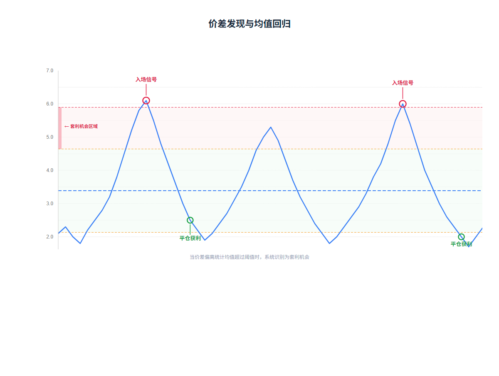
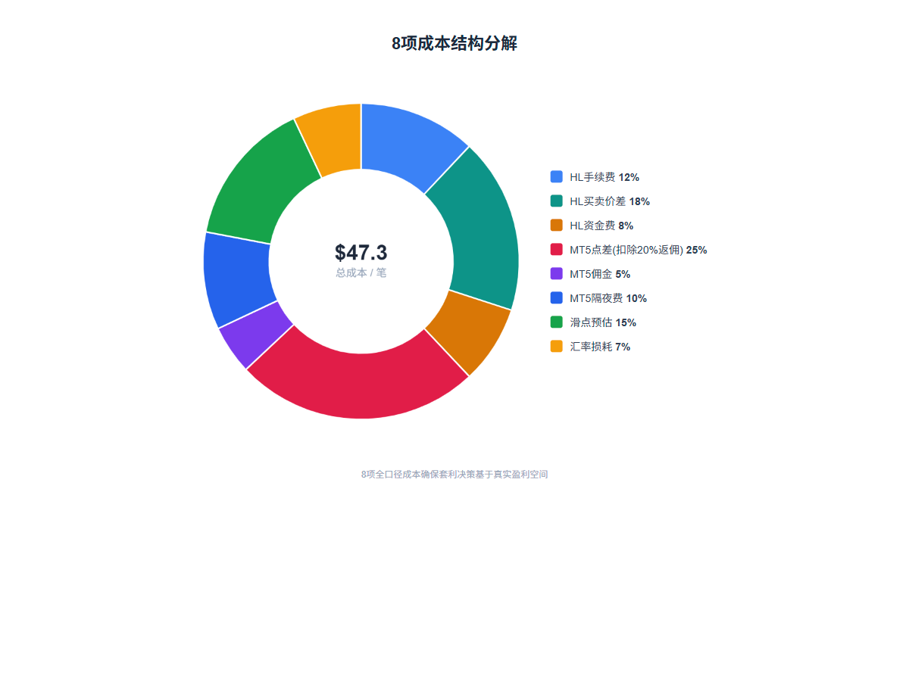
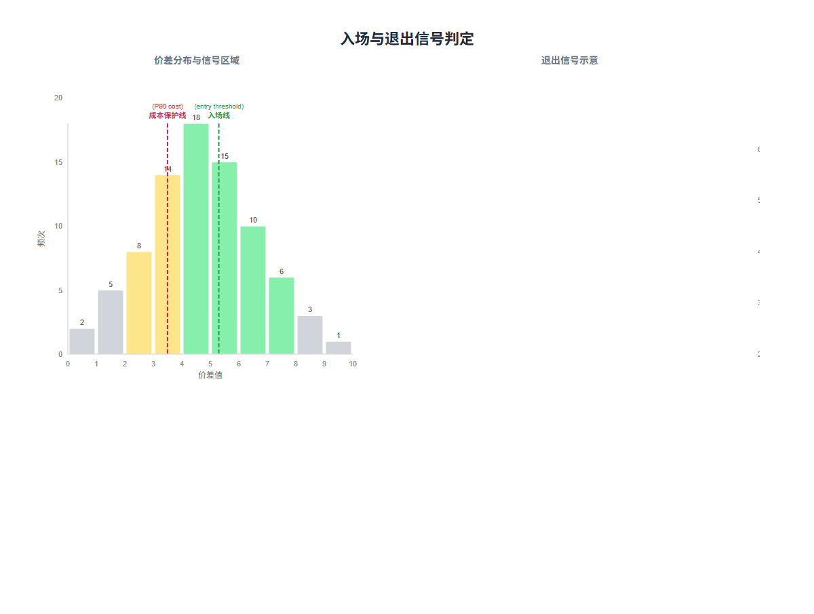
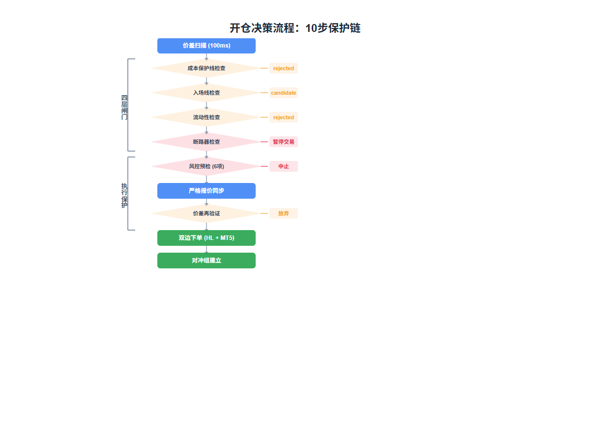
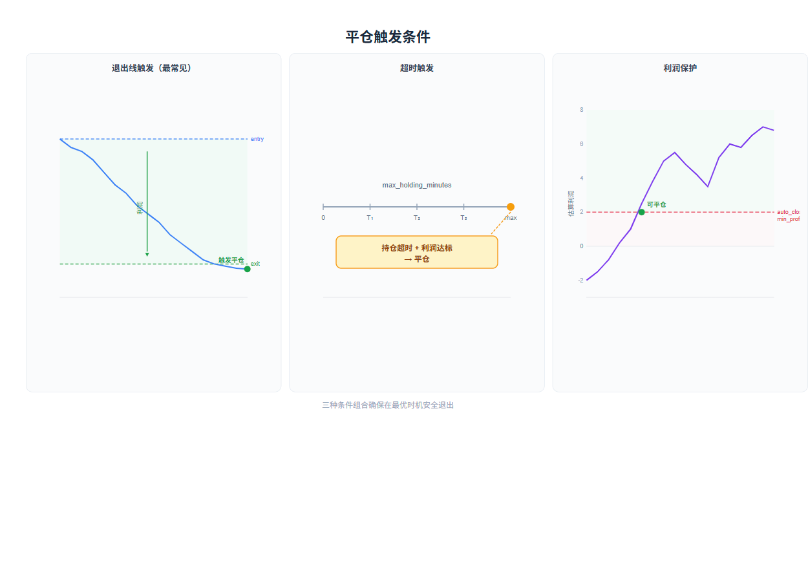

# 跨平台套利实战：如何在 Hyperliquid 和 MT5 之间捕捉价差利润

## 引言

跨平台套利的核心逻辑用一句话就能说清楚：**同一资产在不同交易所的价差会均值回归**。当价差偏离正常区间时双边开仓，等价差回归时平仓，赚取统计意义上的稳定收益。

我们选择 Hyperliquid（加密永续合约 DEX，7×24 运行）和 MT5（外汇/CFD 经纪商，覆盖传统资产）作为两个交易端点。两者之间的资产重叠——黄金、指数等——天然存在价差，而且因为市场结构完全不同（一个是链上 orderbook 驱动的永续合约，一个是传统经纪商的 CFD 报价），价差的均值回归特性比同构交易所之间更稳定。

给一个直觉例子：假设黄金在 Hyperliquid 报价 2350/2352（bid/ask），MT5 报价 2355/2357。你在高价的 MT5 卖空、在低价的 Hyperliquid 买入，入场价差是 3 美元。如果价差随后扩大到 8 美元时你仍然持有，等价差回到 3 美元时平仓，你就赚了 5 美元的差价。当然，实际交易中还要扣除成本，但这就是套利的基本逻辑。

这篇文章聚焦策略本身——价差如何发现、什么时候买入、什么时候卖出、成本如何影响决策、风控如何保护资金——用具体的数字和场景来还原我们的实战经验。

---

## 第一章 — 价差是怎么发现的

> 核心问题：两个完全不同类型的交易所之间，"价差"到底怎么定义、怎么计算？

系统每 **100ms** 同时对两个平台发起行情扫描，计算跨平台价差。但不是简单地用价格做减法——价差计算必须考虑买卖方向，因为你开仓时要按 ask 买入、按 bid 卖出，这些才是你真正能成交的价格。

### 两个交易方向

系统支持两个对称的方向：

- **做多 HL / 做空 MT5**（long_leg_a_short_leg_b）
- **做多 MT5 / 做空 HL**（long_leg_b_short_leg_a）

以黄金 XAUUSD 为例，HL 报价 2350/2352，MT5 报价 2355/2357：

| 方向 | 入场价差计算 | 结果 |
|------|-------------|------|
| 做多 HL / 做空 MT5 | MT5 bid − HL ask = 2355 − 2352 | **3 美元** ✅ |
| 做多 MT5 / 做空 HL | HL bid − MT5 ask = 2350 − 2357 | **−7 美元** ❌ |

价差为正才有利可图。系统在两个方向上同时计算，选择更优的方向。

### 三种口径的价差

这是一个容易忽略但至关重要的设计。开仓和平仓面对的"保守价格"方向相反，用同一个价差做两件事会导致决策偏差。所以我们维护三种口径：

用伪代码表示：

```
entry_spread  → 开仓用：考虑买卖方向的保守估计
close_spread  → 平仓用：反向操作的保守估计
mid_spread    → 研究用：中间价之差，不参与交易决策
```

- **entry_spread** 用"你能成交的最差价格"——买入用 ask，卖出用 bid，确保实际成交不会比这个更差
- **close_spread** 用平仓方向的保守估计
- **mid_spread** 是简单的中间价之差 `(leg_a_mid - leg_b_mid)`，只用于统计研究和图表

### 均值回归假设与统计定义

价差计算出来后，核心假设是：**价差会回到历史平均水平**。但"偏离正常"需要精确定义。我们用标准差和分位数来刻画：

- **P75**：历史价差的 75 分位数，意味着当前价差比历史上 75% 的时间都大
- **mean + 1σ**：均值加一倍标准差，表示显著偏离正常水平


*价差在两个平台之间波动，当偏离超过统计阈值时产生套利机会*

### 真实成交价差回写

开仓时的入场价差是基于报价的估算值。实际成交后，系统会用真实的成交均价重新计算并回写。这是因为报价估算和真实成交之间通常有 **5%-15%** 的偏差——滑点、部分成交都会影响最终价格。不回写的话，后续平仓决策就会基于一个不准确的基准。

---

## 第二章 — 成本：套利利润的真正杀手

> 核心问题：如果算不准成本，套利就是亏钱的另一种说法。

我们最初只算了 4 项成本（手续费、点差、佣金、滑点），上线第一周就发现实际利润比预估低了 15-20%。排查后补齐到 8 项，偏差缩小到 3-5%。教训是：**成本模型宁可多算不可少算**。多算一项，最坏是少做几笔（错过机会）；少算一项，结果是做了亏本交易。

### 8 项全口径成本

| # | 成本项 | 来源 | 说明 |
|---|--------|------|------|
| 1 | HL 手续费 | Hyperliquid | Taker/Maker 费率不同，开仓+平仓各一次 |
| 2 | HL 买卖价差 | Hyperliquid | `ask - bid` × 数量，DEX 订单簿的隐含成本 |
| 3 | HL 资金费 | Hyperliquid | 永续合约 funding rate，持仓方向决定收/付 |
| 4 | MT5 点差 | MT5 | `ask - bid` 比例，**扣除 20% 返佣后**计入 |
| 5 | MT5 佣金 | MT5 | 按名义价值比例收取 |
| 6 | MT5 隔夜费 | MT5 | swap 成本，持仓过夜时产生 |
| 7 | 滑点预估 | 双边 | 按基点计算的预估滑点 |
| 8 | 汇率损耗 | 跨币种 | MT5 品种计价货币与 USD 之间的转换成本 |

### 具体算一笔账

假设一笔 $10,000 名义价值的黄金套利，各成本项大致如下：

| 成本项 | 金额（估算） |
|--------|-------------|
| HL 手续费（taker） | ~$10 |
| HL 买卖价差 | ~$5 |
| HL 资金费（持仓期间） | ~$3 |
| MT5 点差（扣除20%返佣后） | ~$12 |
| MT5 佣金 | ~$5 |
| MT5 隔夜费 | ~$2 |
| 滑点预估 | ~$7 |
| 汇率损耗 | ~$3 |
| **合计** | **~$47** |

这意味着价差收益至少要覆盖 $47 才有利润空间。如果入场价差是 5 美元/盎司、交易 10 盎司，总价差收益 $50，扣除 $47 成本后只剩 $3 利润——稍微波动一下就亏钱了。

### 成本保护线

成本的最终产出是一条**成本保护线**，取历史成本数据的 **P90** 分位数。

含义：在 90% 的历史时间里，成本都低于此值。只有价差超过成本保护线，才认为交易有盈利可能。这是一个保守但必要的过滤——我们不希望因为成本低估而做出错误的开仓决策。


*典型品种的 8 项成本占比分解，不同品种的成本结构差异显著*

---

## 第三章 — 什么时候买入：入场信号系统

> 核心问题：价差多大时该入场？固定阈值行不行？

最初我们用固定阈值——价差超过 X 就开仓。跑了一周就发现问题：XAUUSD 的价差标准差约 2-5，SPX500 的约 12-20，同一个阈值前者频繁触发、后者几乎不动。手动调参更痛苦——市场波动率一变，参数又不对了。最终改成**统计驱动**的方案，让系统根据每个品种自身的价差分布动态计算入场线。

### 入场线计算

入场线取两个值中的较大者：

```python
reachable_entry = max(P75(entry_spreads), mean + 1.0 * std)
# 品种级最小入场线保护
entry_threshold = max(reachable_entry, min_entry_spread)
```

- **P75** 保证"这个价差在历史上属于偏大的"
- **mean + 1.0σ** 保证"价差显著偏离正常水平"
- **min_entry_spread** 是品种级的硬底线，防止统计参数在冷启动期间过于宽松

### 入场前必须通过的条件

即使价差超过了入场线，还要逐层检查：

1. **价差 > 成本保护线（P90 cost）** → 否则拒绝，连成本都覆盖不了
2. **价差 ≥ 入场线** → 否则保留为候选，还不够好
3. **单位利润 ≥ 最小单位利润** → 否则保留为候选，每单位赚的太少
4. **总利润 ≥ 最小总利润** → 否则保留为候选，绝对金额不够
5. **统计样本充足** → 否则只保留为候选，数据不够不能贸然入场

### 信号状态机

每个扫描结果都会经过信号评估，输出一个状态：

```
拒绝 → 候选 → 可执行 → 已执行
```

| 状态 | 含义 | 下一步 |
|------|------|--------|
| 拒绝 | 价差不满足基本条件（未覆盖成本、统计样本不足等） | 不进入后续流程 |
| 候选 | 价差有潜力但还没达标（未达到入场线、利润不足等） | 继续监控，等待条件达标 |
| 可执行 | 达到入场线，四层闸门全部通过 | 进入开仓流程 |
| 已执行 | 订单已提交执行 | 等待成交回报 |

状态是单向流转的：拒绝不会变成候选，候选只有条件达标才会变成可执行。这种设计确保了信号质量的严格把控——只有真正达标的机会才会进入执行阶段。

### 四层闸门进一步过滤

通过信号评估后，还要经过四层闸门：

| 闸门 | 检查内容 | 不通过的后果 |
|------|---------|-------------|
| Market Gate | 品种启用？MT5 在交易时段？报价同步？ | 直接拒绝 |
| Signal Gate | 统计信号达标？品种最小入场线？ | 降级为候选 |
| Risk Tags | 价差超过 P99 过热线？ | 打标但**不阻断** |
| Liquidity Gate | HL 订单簿深度够不够？ | 拒绝 |


*信号状态机：从拒绝到可执行的逐层过滤过程*

### 举例

假设 XAUUSD 的统计参数：P75 价差 = 4.2 美元，mean + σ = 3.8 美元，入场线取较大值 **4.2 美元**。成本保护线（P90 cost）= 2.5 美元。

当前价差 5.1 美元：
- 5.1 > 2.5（成本保护线）✅
- 5.1 ≥ 4.2（入场线）✅
- 利润空间 = 5.1 − 2.5 = 2.6 美元/单位 ✅
- 四层闸门全部通过 → **可执行**，可以执行

---

## 第四章 — 开仓：从信号到下单的 10 步保护链

> 核心问题：信号说"可以买"，就真的应该买吗？

即使信号标记为可执行，从信号到实际下单之间还有 **10 步检查**，任何一步失败都会中止。为什么需要这么多步？因为两个交易所是完全独立的系统，不存在分布式事务。如果一腿成功另一腿失败，就形成了**单腿暴露**——套利系统最危险的状态。所以必须在开仓前尽可能排除所有风险。

### 10 步流程

| 步骤 | 检查内容 | 失败场景举例 |
|------|---------|-------------|
| 1. 信号验证 | 状态必须是可执行 | 信号已过期或被降级 |
| 2. 执行模式检查 | paper/live 模式就绪 | 实盘未启用、paper 就绪检查未过 |
| 3. 品种映射验证 | 品种映射配置存在且有效 | 品种未配置或已停用 |
| 4. MT5 会话权限 | 当前时段允许开仓 | MT5 非交易时段、只允许平仓 |
| 5. MT5 订单预检 | 订单可行性检查通过 | 保证金不足、手数不合法 |
| 6. 严格报价同步 | 500ms 容忍，不信任缓存 | 行情超过 500ms 未更新 |
| 7. 价差再验证 | 用新行情重算价差 | 刷新后价差不再满足入场线 |
| 8. 风控预检 | 6 项风控检查 | 保证金率过低、滑点过大 |
| 9. 创建对冲记录 | 写入对冲组记录，状态为 opening | — |
| 10. 双边下单 | 根据执行模式提交订单 | 一腿成交另一腿失败 |

### 关键步骤详解

**第 6 步：严格报价同步**。扫描用的宽松模式容忍 3000ms 时间差，但执行时不能容忍——3 秒前的行情在套利场景里已经是"历史数据"。如果严格同步（500ms）失败，系统会**主动刷新行情**，然后再次同步。

**第 7 步：价差再验证**。看起来和第 1 步重复，实际上不重复。因为在刷新行情的过程中，价差可能已经变了。我们遇到过真实案例：扫描时价差 5.1 达标，严格同步后缩到 4.0（低于入场线 4.2），放弃开仓。

**第 8 步：风控预检**。开仓前必须通过 6 项风控检查，详见第六章。

### 仓位大小计算

仓位计算从目标 USD 名义价值出发，反向推算各平台的下单数量：

```
目标名义价值（USD）→ MT5 手数 → MT5 基础数量 → HL 等值 USD 数量
```

MT5 的手数有最小手数和手数步长的限制，系统会向上取整到最近的合法手数。HL 的数量则根据 MT5 手数的 USD 等值来确定，确保两腿的名义价值匹配。

为什么以 MT5 为基准而不是 HL？因为 MT5 的手数约束更严格（最小手数 0.01、步长 0.01），先确定 MT5 手数再反算 HL 数量，可以避免 MT5 侧出现不合法的手数导致订单被拒绝。

### 执行模式

系统支持四种执行模式，适应不同阶段的验证需求：

| 模式 | 说明 | 适用场景 |
|------|------|----------|
| 双边市价单 | HL 和 MT5 都按市价单成交 | 默认模式，最简单快速 |
| HL 挂单 + MT5 市价单 | HL 侧挂 post-only 限价单省手续费，MT5 侧市价单 | 降低 HL 手续费成本，但 HL 限价单可能不成交 |
| 纯模拟 | 所有订单在本地模拟成交，带随机延迟 | 策略逻辑验证阶段 |
| 模拟 + 探针 | 纸面模拟 + 在 HL 上提交真实小额探针单 | 验证行情和订单通道的真实性 |

纯模拟和模拟+探针模式用于实盘前的验证阶段，确保策略在真实市场环境下表现符合预期。

### 对冲组状态机

双边下单后，对冲组会经历以下状态流转：

```
opening → open / open_partial → closing → closed
                ↓
        manual_intervention
```

| 状态 | 含义 | 后续处理 |
|------|------|----------|
| opening | 订单已提交，等待成交回报 | 等待或检查 pending 状态 |
| open | 双边订单全部成交 | 进入持仓监控，等待平仓信号 |
| open_partial | 部分成交 | 需要人工关注，可能需要补单或冲销 |
| closing | 平仓订单已提交 | 等待平仓成交回报 |
| closed | 平仓完成 | 记录实现盈亏，归档 |
| manual_intervention | 单边成交异常 | 需要人工处理，系统不会自动恢复 |
| failed | 双边下单均失败 | 记录失败原因，可重试 |

最关键的状态是 **manual_intervention**：一腿成交另一腿失败，形成了单腿暴露。这是套利系统最危险的状态——系统不会自动尝试修复，而是等待人工介入。为什么不让系统自动冲销？因为自动冲销可能在不利价位上执行，造成更大的损失。人工判断虽然慢，但在这种异常场景下更安全。


*从信号触发到双边下单的完整保护链，每一步都可能中止执行*

### 举例

扫描时发现 XAUUSD 价差 5.1 美元，超过入场线 4.2，信号标记为可执行。开始执行：步骤 1-5 顺利通过，步骤 6 严格同步时发现行情已过期，主动刷新 MT5 和 HL 行情。步骤 7 用新行情重算价差——只剩 4.0 美元，低于入场线 4.2。**放弃开仓**，记录原因。这就是"不信任缓存"的价值。

---

## 第五章 — 什么时候卖出：三种平仓触发条件

> 核心问题：开仓后什么时候退出？价差一定会回归吗？

开仓后，系统持续监控持仓状态。平仓不是等一个条件，而是三种触发条件**谁先满足谁执行**：

### 条件一：退出线触发（最常见）

```
退出线 = min(P25(历史平仓价差), 入场价差 − 成本 − 利润缓冲)
```

当平仓价差 ≤ 退出线时触发。含义：价差回归到历史较低水平，或者已经锁定足够利润。

取较小值意味着**只要满足任一条件就平仓**——这是保守策略，确保不错过平仓窗口。

### 条件二：超时触发

当持仓时间超过最大持仓时限且利润达标时触发。为什么需要超时？因为价差回归不是必然的。有些时候开仓后价差不但不回归，反而继续扩大。如果没有超时机制，资金会被一直占用，承担资金费和隔夜费，最终可能从浮盈变浮亏。超时平仓的逻辑是：持仓够久了，利润仍然达标，先锁定利润。

### 条件三：利润保护

无论哪种触发条件，估算平仓利润必须 ≥ 最小自动平仓利润。这是安全阀——防止在亏损状态下自动平仓。

### 平仓执行顺序

平仓时先平 HL 腿 → 确认成交后平 MT5 腿（reduce_only）。如果 HL 腿部分成交，MT5 腿按比例调整数量，避免过度对冲。


*三种平仓条件的触发逻辑，满足任一即执行（需通过利润保护检查）*

### 举例

入场价差 5.1 美元，成本 2.5 美元，退出线 2.0 美元。

- 持仓 2 分钟后，价差回到 2.0 美元 → 触发退出线平仓
- 利润 = (5.1 − 2.0 − 2.5) × 数量 = 0.6 美元/单位
- 如果 0.6 × 数量 < 最小自动平仓利润 → 不平，继续等
- 如果持仓到了最大持仓时限，价差在 2.5 美元，利润 = (5.1 − 2.5 − 2.5) × 数量 = 0.1 美元/单位 → 如果达标则超时平仓

---

## 第六章 — 自适应断路器：价差抖动时的自我保护

> 核心问题：价差在入场线附近反复穿越时，怎么避免频繁开仓？

断路器要解决的问题很具体：当价差在入场线附近高频抖动（+→-→+→-），这时候开仓很可能刚入场就面临反向运动。这个模块是被市场"教"出来的——早期没有断路器，非农数据发布后几秒内系统连续触发开仓信号，每笔开仓后立刻面临反向运动，累积亏损不容忽视。

### 监控对象与抖动率

每个品种有独立的断路器实例，监控该品种**跨平台价差的变化序列**。

抖动率（jitter ratio）衡量价差变化方向的交替频率：

```python
changes = [spreads[i+1] - spreads[i] for i in range(len(spreads) - 1)]
non_zero = [c for c in changes if abs(c) > 1e-9]  # 过滤零变化
alternations = sum(1 for j in range(1, len(non_zero))
                   if sign(non_zero[j]) != sign(non_zero[j-1]))
jitter_ratio = alternations / (len(non_zero) - 1)
```

直觉理解：价差一直涨（+++++），抖动率 = 0；价差上下交替（+-+-+），抖动率接近 1。

### 自适应阈值

| 阶段 | 条件 | 阈值 |
|------|------|------|
| 冷启动 | 样本 < 50 | 固定 0.75 |
| 自适应 | 样本 ≥ 50 | P75(历史抖动率) × 2.0 |

为什么用自适应而不是固定值？我们有一个流动性较差的品种，价差天然有较高的方向交替频率，正常 jitter 就在 0.6-0.7 之间。固定阈值 0.75 频繁误触发，这个品种几乎无法交易。改成自适应后，根据每个品种自身的"正常抖动水平"设定阈值，误触发率大幅下降。

### 触发与恢复

```
CLOSED（正常）─── jitter > threshold ───→ OPEN（阻断交易）
     ↑                                        │
     └──── 冷却 3 秒 ────────────────────────┘
```

触发后阻断该品种所有交易（包括开仓和平仓），冷却 **3 秒**后自动恢复。恢复后如果抖动仍然很高，会再次触发。

### 举例

某品种正常抖动率 P75 = 0.3，自适应阈值 = 0.3 × 2.0 = **0.6**。当前 5 秒检测窗口内，价差方向频繁交替，计算得 jitter = 0.8 > 0.6 → 断路器 OPEN，暂停该品种交易 3 秒。3 秒后恢复 CLOSED，如果市场已稳定则正常交易。

### 开仓前风控 6 项检查

除了断路器，开仓前还有一道硬性关卡：**6 项风控预检**。任何一项不通过，开仓立即中止。这套检查是保护资金的最后一道防线——即使信号再好、价差再诱人，如果账户状态不允许，也不能下单。

| # | 检查项 | 说明 |
|---|--------|------|
| 1 | 风控模式 | 系统处于 paused / emergency_stop / reduce_only 模式时禁止开新仓 |
| 2 | 单笔名义值 | 本笔订单名义价值不超过上限，防止单笔过大 |
| 3 | 预估滑点 | 滑点超过基点上限时中止，防止流动性不足时硬下单 |
| 4 | 可用保证金 | 新增保证金不超过可用余额的折扣上限 |
| 5 | 保证金率 | 账户保证金率不低于最低要求，防止触发强制平仓 |
| 6 | 行情年龄 | 行情数据超过最大允许年龄时中止，防止用过时行情下单 |

这 6 项检查覆盖了账户状态、订单规模、市场质量三个维度。其中“行情年龄”容易被忽略：如果行情超过几秒没更新，说明某个平台的连接可能出了问题，这时候用旧行情下单风险极大。

### MT5 交易时段保护

MT5 不是 7×24 运行的。不同品种有不同的交易时段，而且不同时段的权限可能不同。系统的权限管理精确到**动作级别**：

| 权限 | 含义 |
|------|------|
| 允许开多 | 当前时段可以建立多头仓位 |
| 允许开空 | 当前时段可以建立空头仓位 |
| 允许平多 | 当前时段可以关闭多头仓位 |
| 允许平空 | 当前时段可以关闭空头仓位 |

这意味着可以出现“允许平多但不允许开多”的情况——比如接近收盘时只允许减仓不允许加仓。这种细粒度控制确保了在 MT5 非交易时段或限制时段不会误操作，避免订单被拒绝或产生不必要的风险暴露。

### 执行回查器：异常状态的最后一道防线

即使开仓前有 10 步保护链，实盘中仍然可能出现意外：订单提交后网络断开、一腿成交另一腿超时、或者系统重启后状态不一致。执行回查器负责周期性检查这些异常情况：

| 检查项 | 说明 | 处理方式 |
|--------|------|----------|
| Pending 订单检查 | 已提交但未成交的订单状态 | 确认成交、取消或标记超时 |
| 单腿成交异常 | 一腿成交另一腿失败 | 触发冲销或标记为人工介入 |
| 孤儿仓位检测 | 没有对冲组关联的孤立仓位 | 标记并报警，等待人工处理 |

最关键的是**单腿成交异常**处理：如果 HL 腿成交了但 MT5 腿失败，系统会尝试在 MT5 侧反向冲销相同数量，把单腿暴露平掉。如果冲销也失败，则标记为 manual_intervention，等待人工介入。为什么不让系统无限重试？因为市场可能在快速变化，无限重试可能在不利价位上累积更多风险。

### 过热线（P99）：打标不阻断

除了断路器，系统还维护一条**过热线**，取历史入场价差的 **P99** 分位数。当价差超过过热线时，系统会打上“过热”标签，但**仅标记不阻断**。

为什么不阻断？这个问题我们内部讨论过。一种观点是：既然标记了过热，说明风险很高，应该直接阻断。但另一种观点更有说服力：极端价差可能意味着短暂的市场异常，但也可能是千载难逢的机会——2024 年黄金暴涨期间，价差一度突破 P99.5，如果当时阻断了，会错过一笔很好的交易。最终选择了“打标不阻断”的折中方案——前端展示警告，但系统不做硬性限制。让操作员自己判断，系统不越权。

---

## 第七章 — 实战中的关键经验

> 纸上得来终觉浅。这一章总结我们在实盘中踩过的坑和积累的经验。

### 成本估算的演进

从 4 项到 8 项，预估利润偏差从 **15-20%** 降到 **3-5%**。三个关键遗漏项是：资金费（HL 永续合约的 funding rate，持仓方向不利时是净支出）、隔夜费（MT5 的 swap，持仓超过一天就累积）、汇率损耗（MT5 上 EUR/JPY 计价品种换算成 USD 的隐含成本）。每一项单独看不大，但加起来能吃掉大部分利润。

### 报价估算 vs 真实成交

开仓时基于报价估算的入场价差和实际成交后回写的真实值之间，通常有 **5-15%** 的偏差。这就是为什么必须用真实成交数据回写——不回写的话，平仓决策基于一个不准确的基准，该平时不平、不该平时乱平。

### 统计参数的漂移

入场线、退出线依赖历史价差的统计分布。但分布本身会随市场结构变化而漂移——比如一个品种上线了新的做市商后，价差分布可能发生结构性变化。目前的做法是定期刷新统计参数，但还没有引入"漂移检测"机制——这是未来需要改进的地方。

### 内存优先的取舍

100ms 扫描不写库，5s 批量落库。最坏情况丢 5 秒快照。但真正重要的数据（订单、成交、对冲组状态）都有独立的事务保护，不在这条路径上。这个取舍的核心逻辑是：**扫描快照可以丢，交易数据不能丢**。

### 渐进式实盘：三个阶段的安全演进

系统设计了三个阶段的渐进式实盘验证：

| 阶段 | 说明 | 验证目标 |
|------|------|----------|
| paper | 纯纸面模拟，所有订单在本地模拟成交，带随机延迟 | 策略逻辑验证 |
| paper+probe | 纸面模拟 + 在 Hyperliquid 上提交真实的小额探针单 | 验证行情和订单通道的真实性 |
| live | 完全实盘，双边真实下单 | 正式运行 |

这三个阶段不是自动切换的，需要操作员手动推进。每个阶段都应该运行足够长的时间来验证系统行为。

为什么要分三个阶段？因为我们在一开始就吃过亏。最早的时候，系统从 paper 直接切到 live，结果第一天就遇到了问题：paper 模式下 HL 的成交是模拟的（按 mid price 成交），但实盘中 HL 的 taker 单是按对手价成交的，两者之间有一个买卖价差的差距。这导致 paper 觉得有利可图的信号，实盘中可能已经亏钱了。

后来我们加了 paper+probe 阶段：在 paper 模拟的同时，在 HL 上提交真实的小额探针单（不持仓，立即平仓），用真实的成交数据来校准模型。这个阶段帮我们发现了好几个 paper 模式下看不到的问题：HL 的 API 延迟分布不是正态的（偶尔会有 500ms+ 的长尾）、订单簿深度在特定时段会突然变薄。探针单的成本很低，但提供的信息价值远超成本。

---

## 总结

跨平台套利策略的核心是三个支柱：**统计驱动的入场/退出信号**、**全口径成本模型**、**多层风控保护**。

- 价差发现不是简单的价格减法，要考虑买卖方向和三种口径
- 入场线和退出线由每个品种自身的统计分布动态决定，不一刀切
- 8 项成本全覆盖，成本保护线取 P90 确保 90% 的时间里成本可控
- 10 步开仓保护链 + 3 种平仓触发条件 + 自适应断路器，多层兜底

坦率地说，系统还有改进空间：统计参数的漂移检测、更智能的执行算法（TWAP、冰山单）、更多交易所接入。回顾整个过程，最大的体会是：**套利系统的竞争力不在策略本身，而在工程可靠性**。策略思路是公开的，成本模型和信号计算也不是秘密，但能不能在 100ms 内稳定完成计算、能不能在双边下单中保证安全、能不能在异常情况下正确恢复——这些工程细节才是决定系统能不能长期运行的关键。
